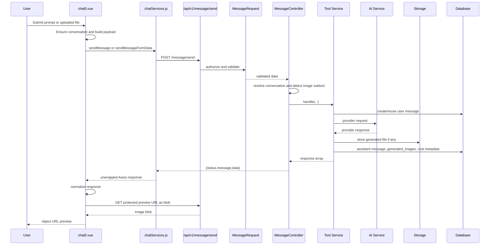
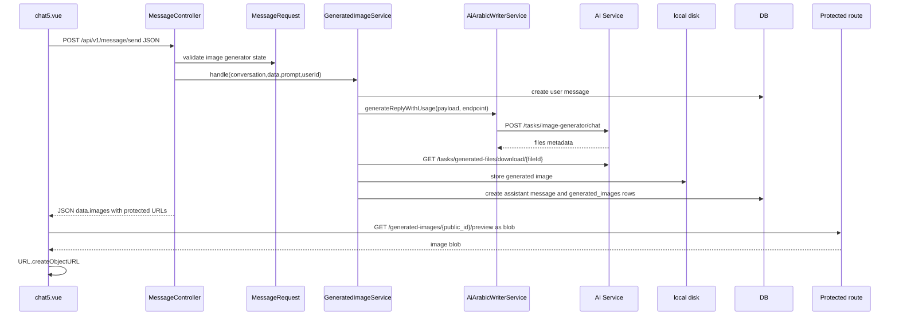
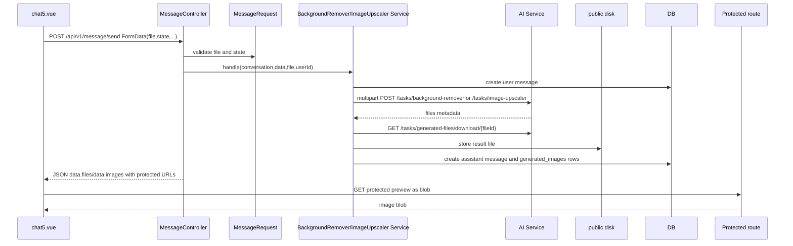
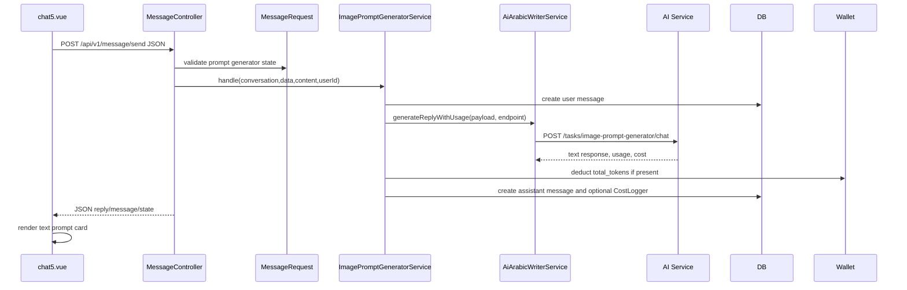

# Chat5 Architecture & Data Flow

## 1. Executive Summary

This document describes the current Chat5 implementation as traced from the repository. It is analysis and documentation only.

Verified frontend entry point: `resources/js/views/home/chat5.vue`.

Verified frontend route: `/:lang/subtool/:slug/chat5/:uuid?` in `resources/js/router/index.js`.

Verified backend entry point for Chat5 send operations: `POST /api/v1/message/send` registered in `routes/api.php`, handled by `App\Http\Controllers\api\home\MessageController::sendMessage`.

Chat5 supports four image-related subtools in the component:

| Subtool | `sub_tool_id` | `tool_key` | `model_key` |
|---|---:|---|---|
| AI Image Generator | 21 | `ai_image_generator` | `image_generator` |
| AI Background Remover | 22 | `ai_background_remover` | `background_remover` |
| AI Image Upscaler | 23 | `ai_image_upscaler` | `image_upscaler` |
| AI Image Prompt Generator | 24 | `image_prompt_generator` | `image_prompt_generator` |

Actual backend dispatch is service-based, not a visible Terra/Luna agent class in this repo:

| Subtool | Service |
|---|---|
| 21 | `App\Services\GeneratedImageService` |
| 22 | `App\Services\BackgroundRemoverService` |
| 23 | `App\Services\ImageUpscalerService` |
| 24 | `App\Services\ImagePromptGeneratorService` |

`Terra` / `Luna`: UNKNOWN / NOT VERIFIED. No `Terra`, `Luna`, `terra`, or `luna` implementation was found in the traced Chat5 backend path.

## 2. Chat5 Frontend Architecture

`resources/js/views/home/chat5.vue` is a single Vue component containing UI, state, request construction, response normalization, protected image preview, image download, wallet sidebar fetch, and route/conversation orchestration.

Important verified functions:

| Function | File | Purpose |
|---|---|---|
| `loadSubtool` | `resources/js/views/home/chat5.vue` | Loads current subtool through `homeService.showSubtool(route.params.slug)`. Falls back to image generator ID 21 on error. |
| `loadConversations` | same | Calls `chatServices.getConversations`, filters by active subtool ID. |
| `loadConversationDetails` | same | Calls `chatServices.getConversation(uuid)`, maps messages, restores latest state, loads previews. |
| `ensureConversation` | same | Creates a conversation when none is active. |
| `buildPayload` | same | Builds JSON payload for image generator and image prompt generator. |
| `buildBgRemoverFormData` | same | Builds multipart payload for subtool 22. |
| `buildUpscalerFormData` | same | Builds multipart payload for subtool 23. |
| `sendMessage` | same | Main send/retry/regenerate handler. |
| `loadImagePreview` | same | Fetches protected blob and creates object URL. |
| `downloadImage` | same | Fetches protected blob and triggers browser download. |
| `openImage` | same | Opens existing or newly fetched object URL. |

State is local Vue state using `ref` and `computed`. There is no external Chat5 store.

The service layer is `resources/js/services/chat/chatServices.js`, which wraps `resources/js/services/ApiClient.js`.

`ApiClient.js` sets:

| Header | Source |
|---|---|
| `Accept` | `application/json` |
| `Accept-Language` | local `lang` storage, default normalized to `ar` in the client |
| `X-API-KEY` | hard-coded public API key |
| `Authorization` | `Bearer ${localStorage.auth_token}` except public auth URLs |
| `X-Device-Fingerprint` | FingerprintJS visitor ID |

## 3. Chat5 Backend Architecture

API routes are registered in `routes/api.php` under prefix `/api/v1`. The global API middleware stack includes:

| Middleware | File | Behavior |
|---|---|---|
| `ApiKeyMiddleware` | `app/Http/Middleware/ApiKeyMiddleware.php` | Requires `X-API-KEY` matching `env('API_KEY')`, except routes explicitly using `withoutMiddleware(ApiKeyMiddleware::class)`. |
| `AcceptLanguage` | `app/Http/Middleware/AcceptLanguage.php` | Sets app locale from `Accept-Language` if in `en`, `ar`, `fr`, `zh`, `ru`. |
| `Utf8JsonResponse` | `app/Http/Middleware/Utf8JsonResponse.php` | Present in stack; not deeply audited for Chat5 behavior. |

Chat5 send flow:

1. `MessageRequest` authorizes authenticated user ownership of `conversation_id` or `conversation_uuid`.
2. `MessageRequest::rules` validates base fields and adds subtool-specific state/file rules.
3. `MessageController::sendMessage` resolves the conversation by authenticated user.
4. It detects the requested tool via `sub_tool_id`, `tool`, `tool_key`, and `model_key`.
5. It ensures selected subtool matches the conversation subtool for image tools.
6. It calls the dedicated service for the image-related tool.
7. The service calls the external AI endpoint, persists messages/files/metadata, and returns an array.
8. `ApiResponse::success` wraps it as `{ status, message, data }`.

## 4. Subtools

### 4.1 Image Generator

Frontend:

| Field | Value |
|---|---|
| `sub_tool_id` | `21` |
| `tool_key` | `ai_image_generator` |
| `model_key` | `image_generator` |

Backend:

| Item | Verified implementation |
|---|---|
| Detection | `GeneratedImageService::supports($subToolId, $toolKey)` |
| Validation | `MessageRequest::imageGeneratorRules` |
| Service | `App\Services\GeneratedImageService` |
| Provider call | `AiArabicWriterService::generateReplyWithUsage($requestPayload, $endpoint)` |
| Default endpoint | `tasks/image-generator/chat` |
| Storage disk | `local`, rooted at `storage/app/private` |
| Storage path | `generated-images/{userId}/{conversationUuid}/{publicId}.{ext}` |
| File DB table | `generated_images` |
| File response URLs | `/api/v1/generated-images/{public_id}/preview`, `/api/v1/generated-images/{public_id}/download` |

### 4.2 Background Remover

Frontend:

| Field | Value |
|---|---|
| `sub_tool_id` | `22` |
| `tool_key` | `ai_background_remover` |
| `model_key` | `background_remover` |
| Upload field | `file` |

Backend:

| Item | Verified implementation |
|---|---|
| Detection | `BackgroundRemoverService::supports($subToolId, $toolKey, $modelKey)` |
| Validation | `MessageRequest::backgroundRemoverRules` |
| Service | `App\Services\BackgroundRemoverService` |
| Provider call | Direct multipart `POST {services.ai.base_url}/tasks/background-remover` |
| Storage disk | `public`, rooted at `storage/app/public` |
| Storage path | `background-remover/{userId}/{conversationUuid}/{publicId}.{ext}` |
| File response URLs | named routes `background-remover.files.preview/download` |

Important setup note: no seeder/migration creating subtool 22 was found, except test setup. Runtime DB row for subtool 22 is UNKNOWN / NOT VERIFIED from repository code alone.

### 4.3 Image Upscaler

Frontend:

| Field | Value |
|---|---|
| `sub_tool_id` | `23` |
| `tool_key` | `ai_image_upscaler` |
| `model_key` | `image_upscaler` |
| Upload field | `file` |
| State fields | `scale`, `face_enhance`, `provider`, `last_output` |

Backend:

| Item | Verified implementation |
|---|---|
| Detection | `ImageUpscalerService::supports($subToolId, $toolKey, $modelKey)` |
| Validation | `MessageRequest::imageUpscalerRules` |
| Service | `App\Services\ImageUpscalerService` |
| Provider call | Direct multipart `POST {services.ai.base_url}/tasks/image-upscaler` |
| Storage disk | `public`, rooted at `storage/app/public` |
| Storage path | `image-upscaler/{userId}/{conversationUuid}/{publicId}.{ext}` |
| File response URLs | named routes `image-upscaler.files.preview/download` |

Setup concern: `database/migrations/2026_08_04_000000_add_image_upscaler_sub_tool.php` creates slug `ai_image_upscaler` and does not set `endpoint` or `config`. The service has its own endpoint constant, so sending can still work if the conversation is created for ID 23. UI navigation slug correctness in the deployed DB is UNKNOWN / NOT VERIFIED.

### 4.4 Image Prompt Generator

Frontend:

| Field | Value |
|---|---|
| `sub_tool_id` | `24` |
| `tool_key` | `image_prompt_generator` |
| `model_key` | `image_prompt_generator` |

Backend:

| Item | Verified implementation |
|---|---|
| Detection | `ImagePromptGeneratorService::supports($subToolId, $toolKey, $modelKey)` |
| Validation | `MessageRequest::imagePromptGeneratorRules` |
| Service | `App\Services\ImagePromptGeneratorService` |
| Provider call | `AiArabicWriterService::generateReplyWithUsage($requestPayload, $endpoint)` |
| Default endpoint | `tasks/image-prompt-generator/chat` |
| Storage | No image file storage; text response only |
| Wallet | Deducts wallet tokens when usage `total_tokens > 0` |

Setup concern: `ImagePromptGeneratorSeeder` exists, but `DatabaseSeeder` comments it out. Runtime DB row for subtool 24 is UNKNOWN / NOT VERIFIED from repository code alone.

## 5. Complete Request Flow



## 6. Conversation Flow

Frontend:

| Operation | Function | Backend |
|---|---|---|
| Load conversations | `loadConversations` | `GET /api/v1/conversation` |
| Load one conversation | `loadConversationDetails` | `GET /api/v1/conversation/{uuid}` |
| Create conversation | `ensureConversation`, `startNewChat` | `POST /api/v1/conversation/{slug}` |
| Delete conversation | `deleteConversation` | `DELETE /api/v1/conversation/{uuid}` |

Backend:

| Endpoint | Controller |
|---|---|
| `GET /api/v1/conversation` | `ConversationController::conversation` |
| `GET /api/v1/conversation/{uuid}` | `ConversationController::conversationDetails` |
| `POST /api/v1/conversation/{slug}` | `ConversationController::createConversation` |
| `DELETE /api/v1/conversation/{uuid}` | `ConversationController::conversationDelete` |

`createConversation` uses `SubToolRepository::showBySlug($slug)` and creates `conversations.sub_tool_id` from the DB subtool ID. This means frontend route slug must resolve to the intended backend subtool row.

Conversation title behavior:

| Subtools | Current code behavior |
|---|---|
| 17, 18, 19, 20, 21 | `ConversationController` and `Message` model apply title from first user message. |
| 22, 23, 24 | Not included in `CHAT4_SUB_TOOL_IDS`; frontend still derives display title from `first_user_message_content` or messages when available. |

## 7. Message Flow

Image services create messages synchronously:

1. User message is created with `conversation_id`, `role=user`, `content`, `idempotency_key`, and metadata.
2. Provider is called.
3. Assistant message is created with `reply_to_message_id`, `role=assistant`, `content`, `metadata`, and `is_error`.
4. `ConversationMessageCacheService::updateAfterMessage` updates the per-conversation cache.
5. Conversation list cache is flushed with tags.

The generic queued `GenerateAssistantReplyJob` exists for other tools, but the four Chat5 image tools handled here do not use it in the verified send path.

## 8. Image Upload Flow

Upload tools: background remover and upscaler.

Frontend upload:

1. User selects file via hidden file input.
2. `handleFileSelect` stores the `File` in `selectedFile`.
3. `selectedFilePreview` is created with `URL.createObjectURL(file)`.
4. Client-side file type/size validation is not implemented in Chat5.
5. On send, `FormData` is created and sent to `POST /api/v1/message/send`.

Backend validation:

| Tool | File validation |
|---|---|
| Background remover | `required`, `file`, max `20480` KB, MIME `image/png,image/jpeg,image/webp,image/svg+xml` |
| Image upscaler | `required`, `file`, max `20480` KB, MIME `image/png,image/jpeg,image/webp,image/svg+xml` |

Backend provider upload:

| Tool | Provider request |
|---|---|
| Background remover | Multipart direct HTTP with `file` to `/tasks/background-remover` |
| Image upscaler | Multipart direct HTTP with `file` to `/tasks/image-upscaler` |

No permanent storage of the original uploaded file was found in these services. The provider result is downloaded and stored.

## 9. Image Generation Flow

Image generator is prompt-only:

1. Frontend sends JSON with prompt and generation state.
2. `GeneratedImageService` creates/reuses user message by idempotency key.
3. Service calls `AiArabicWriterService::generateReplyWithUsage`.
4. Provider response is expected to include files under `files`, `raw.files`, or `raw.data.files`.
5. Service accepts up to 4 files.
6. Each provider file must have a trusted download URL matching `/tasks/generated-files/download/{id}` on the configured AI service origin.
7. Service downloads each file using internal API key.
8. Service validates downloaded bytes as image PNG/JPEG/WebP with max 12 MB.
9. Files are stored on `local` disk.
10. `generated_images` rows are created.
11. Assistant message metadata includes `images`, `failed_files`, usage, cost, request ID, provider, model, and generation details.

## 10. Image Storage Flow

| Tool | Disk | Path | Public URL returned directly? |
|---|---|---|---|
| Image generator | `local` | `generated-images/{userId}/{conversationUuid}/{publicId}.{ext}` | No |
| Background remover | `public` | `background-remover/{userId}/{conversationUuid}/{publicId}.{ext}` | No protected API URL is returned, but disk is public |
| Image upscaler | `public` | `image-upscaler/{userId}/{conversationUuid}/{publicId}.{ext}` | No protected API URL is returned, but disk is public |
| Image prompt generator | none | none | none |

Generated image metadata is stored in both:

1. `messages.metadata.images` or `messages.metadata.files`.
2. `generated_images` rows.

## 11. Protected Image Access

Routes:

| Tool | Preview route | Download route | Controller |
|---|---|---|---|
| Image generator | `GET /api/v1/generated-images/{image}/preview` | `GET /api/v1/generated-images/{image}/download` | `GeneratedImageController` |
| Background remover | `GET /api/v1/background-remover/files/{file}/preview` | `GET /api/v1/background-remover/files/{file}/download` | `BackgroundRemoverFileController` |
| Image upscaler | `GET /api/v1/image-upscaler/files/{file}/preview` | `GET /api/v1/image-upscaler/files/{file}/download` | `ImageUpscalerFileController` |

All protected image/file routes use:

| Requirement | Status |
|---|---|
| `auth:sanctum` | Verified |
| Rate limit | `throttle:60,1` |
| `ApiKeyMiddleware` | Explicitly disabled with `withoutMiddleware(ApiKeyMiddleware::class)` |
| Ownership check | `GeneratedImage.user_id === auth()->id()` |
| Tool-specific check | Background remover requires subtool 22; upscaler requires subtool 23 |
| Missing file check | `Storage::disk(...)->exists(...)`, aborts 404 |

Route model binding uses `GeneratedImage::getRouteKeyName()` returning `public_id`.

## 12. Image Preview Flow

Frontend preview:

1. `normalizeGeneratedImages` requires `id` or `file_id`, `preview_url`, and `download_url`.
2. `loadMessagePreviews` loads all assistant image previews.
3. `toApiUrl` strips leading `/api/v1` for relative URLs so Axios base `/api/v1` does not duplicate it.
4. `chatServices.fetchProtectedBlob(url)` calls `api.get(url, { responseType: "blob" })`.
5. Axios interceptor adds Sanctum bearer token when available.
6. Browser object URL is created with `URL.createObjectURL(blob)`.
7. Object URLs are revoked on conversation change, unmount, and preview replacement.

## 13. Image Download Flow

Frontend download:

1. `downloadImage` normalizes `download_url`.
2. Fetches the protected endpoint as a blob.
3. Creates a temporary object URL.
4. Creates a temporary `<a>`.
5. Sets `download` to `image.filename`.
6. Clicks, removes link, revokes temporary object URL.

Preview and download use separate backend endpoints, but frontend fetch mechanics are the same.

## 14. Agent / Terra / Luna Architecture

Verified current implementation:

| Layer name | Actual code |
|---|---|
| Controller dispatch | `MessageController::sendMessage` |
| Image generator orchestration | `GeneratedImageService` |
| Background remover orchestration | `BackgroundRemoverService` |
| Upscaler orchestration | `ImageUpscalerService` |
| Prompt generator orchestration | `ImagePromptGeneratorService` |
| Generic provider HTTP client | `AiArabicWriterService` |
| Generic queued assistant agent | `GenerateAssistantReplyJob`, not used by these four image service paths |

Terra / Luna architecture: UNKNOWN / NOT VERIFIED. The terms do not appear in the traced repository implementation.

## 15. AI Provider Flow

| Tool | Provider request implementation | Endpoint source |
|---|---|---|
| Image generator | `AiArabicWriterService::generateReplyWithUsage` | subtool config endpoint, subtool endpoint, or `tasks/image-generator/chat` |
| Background remover | direct `Http::attach(...)->post(...)` | `config('services.ai.base_url') + /tasks/background-remover` |
| Image upscaler | direct `Http::attach(...)->post(...)` | `config('services.ai.base_url') + /tasks/image-upscaler` |
| Image prompt generator | `AiArabicWriterService::generateReplyWithUsage` | subtool config endpoint, subtool endpoint, or `tasks/image-prompt-generator/chat` |

Provider credentials:

| Config | File |
|---|---|
| `services.ai.base_url` | `config/services.php` |
| `services.ai.internal_api_key` | `config/services.php` |
| `services.aiarabic.url` | `config/services.php` |
| `services.aiarabic.internal_api_key` | `config/services.php` |

Exact external provider implementation behind the AI service is UNKNOWN / NOT VERIFIED. The code stores provider/model values returned by the AI service, such as `provider`, `model`, or `model_key`.

## 16. Database Architecture

Relevant models:

| Model | Table | Relationships |
|---|---|---|
| `User` | `users` | Has wallet by usage, owns conversations and generated images indirectly |
| `Wallet` | `wallets` | belongsTo user |
| `Conversation` | `conversations` | belongsTo user, belongsTo subtool, hasMany messages, hasMany generated images, hasMany costs |
| `Message` | `messages` | belongsTo conversation, hasMany generated images |
| `GeneratedImage` | `generated_images` | belongsTo user, conversation, message |
| `SubTools` | `sub_tools` | hasMany conversations, hasOne provider, hasMany costs |
| `CostLogger` | `cost_loggers` | referenced by conversation/user/subtool |

Important columns:

| Table | Columns |
|---|---|
| `conversations` | `id`, `user_id`, `sub_tool_id`, `uuid`, `title`, `is_pinned`, `is_archived`, timestamps, soft deletes |
| `messages` | `id`, `conversation_id`, `content`, `metadata`, `is_error`, `role`, `idempotency_key`, `reply_to_message_id`, timestamps, soft deletes |
| `generated_images` | `id`, `public_id`, `user_id`, `conversation_id`, `message_id`, `sub_tool_id`, `source_file_id`, `filename`, `path`, `disk`, `content_type`, `size_bytes`, `metadata`, timestamps |
| `wallets` | `id`, `user_id`, `uuid`, `balance`, `payback_balance`, `is_active`, timestamps, soft deletes |
| `sub_tools` | `id`, `main_tool_id`, `name`, `slug`, `endpoint`, `config`, status fields, timestamps, soft deletes |

Idempotency DB constraints:

| Constraint | Migration |
|---|---|
| unique `conversation_id`, `role`, `idempotency_key` | `2026_05_02_120000_add_idempotency_and_reply_link_to_messages_table.php` |
| unique `reply_to_message_id` | same |

## 17. API Contract

All normal JSON API responses are wrapped by `ApiResponse::success`:

```json
{
  "status": "success",
  "message": "Message text",
  "data": {}
}
```

Errors from `ApiResponse::error`:

```json
{
  "status": "error",
  "message": "Message text",
  "errors": {}
}
```

Frontend unwrap behavior:

1. `chatServices` returns `response.data`.
2. `chat5.vue` calls `responseData`, which uses `unwrapApiData`.
3. `unwrapApiData` repeatedly unwraps `.data` while present.

This matches the backend response wrapper for the traced paths.

## 18. Request Payloads

### Image Generator JSON

Endpoint: `POST /api/v1/message/send`

```json
{
  "sub_tool_id": 21,
  "conversation_uuid": "uuid",
  "user_message": "prompt",
  "state": {
    "provider": null,
    "negative_prompt": "",
    "size": "1024x1024",
    "quality": "medium",
    "results_count": 1,
    "output_format": "png",
    "seed": null,
    "extra_options": [],
    "last_output": null
  },
  "tool": "ai_image_generator",
  "tool_key": "ai_image_generator",
  "model_key": "image_generator",
  "task_key": "ai_image_generator",
  "regenerate": false,
  "idempotency_key": "browser-crypto-random-uuid",
  "debug": false
}
```

Backend validates `state.size`, `state.quality`, `state.results_count`, `state.output_format`, etc. Payload names match backend validation.

### Background Remover FormData

Endpoint: `POST /api/v1/message/send`

| FormData field | Value |
|---|---|
| `conversation_uuid` | conversation UUID |
| `sub_tool_id` | `22` |
| `user_message` | user instruction or default remover message |
| `state` | JSON string, parsed by `MessageRequest` |
| `debug` | `"0"` |
| `tool` | `ai_background_remover` |
| `tool_key` | `ai_background_remover` |
| `model_key` | `background_remover` |
| `idempotency_key` | random UUID |
| `file` | selected browser `File` |

Payload names match backend validation.

### Image Upscaler FormData

Endpoint: `POST /api/v1/message/send`

| FormData field | Value |
|---|---|
| `conversation_uuid` | conversation UUID |
| `sub_tool_id` | `23` |
| `user_message` | user instruction or default upscaler message |
| `state` | JSON string with `scale`, `face_enhance`, `provider`, `last_output` |
| `debug` | `"0"` |
| `tool` | `ai_image_upscaler` |
| `tool_key` | `ai_image_upscaler` |
| `model_key` | `image_upscaler` |
| `idempotency_key` | random UUID |
| `file` | selected browser `File` |

Payload names match backend validation.

### Image Prompt Generator JSON

Endpoint: `POST /api/v1/message/send`

```json
{
  "sub_tool_id": 24,
  "conversation_uuid": "uuid",
  "user_message": "Create a professional image prompt for ...",
  "state": {
    "content": "raw user idea",
    "language": "English",
    "style": "high-end editorial photography",
    "aspect_ratio": "4:5",
    "camera": "medium-wide shot",
    "lighting": "cinematic side lighting",
    "negative_prompt": "text, watermark, blurry image, distorted anatomy",
    "text_policy": "No text",
    "face_policy": "No visible human faces",
    "results_count": 1,
    "extra_options": ["realistic materials", "8K detail"],
    "last_output": null
  },
  "tool": "image_prompt_generator",
  "tool_key": "image_prompt_generator",
  "model_key": "image_prompt_generator",
  "task_key": "image_prompt_generator",
  "regenerate": false,
  "idempotency_key": "browser-crypto-random-uuid",
  "debug": false
}
```

Payload names match backend validation.

## 19. Response Payloads

### Image Generator Data

Service returns:

```json
{
  "success": true,
  "type": "image_generation",
  "tool": "ai_image_generator",
  "provider": "provider",
  "model_key": "model",
  "user_id": 1,
  "sub_tool_id": 21,
  "conversation_uuid": "uuid",
  "message": "Images generated successfully.",
  "state": {},
  "images": [
    {
      "id": "public-uuid",
      "filename": "ai-image-1.png",
      "content_type": "image/png",
      "size_bytes": 123,
      "preview_url": "/api/v1/generated-images/public-uuid/preview",
      "download_url": "/api/v1/generated-images/public-uuid/download",
      "source_file_id": "provider-file-id"
    }
  ],
  "count": 1,
  "metadata": {},
  "failed_files": [],
  "request_id": "provider-request-id",
  "usage": {},
  "cost": {},
  "assistant_message_id": 123
}
```

Frontend expects and normalizes `images`.

### Background Remover / Upscaler Data

Services return both `files` and `images`, with the same array.

```json
{
  "success": true,
  "type": "result",
  "tool": "ai_background_remover or ai_image_upscaler",
  "provider": "provider",
  "model": "model",
  "model_key": "model",
  "user_id": 1,
  "sub_tool_id": 22,
  "conversation_uuid": "uuid",
  "message": "result message",
  "assistant_message_id": 123,
  "files": [
    {
      "id": "public-uuid",
      "filename": "file.png",
      "content_type": "image/png",
      "size_bytes": 123,
      "preview_url": "route-generated-url",
      "download_url": "route-generated-url"
    }
  ],
  "images": [],
  "count": 1,
  "metadata": {},
  "request_id": "provider-request-id",
  "cost": {},
  "state": {}
}
```

Frontend explicitly maps `files` into `images` for both tools before calling `normalizeGeneratedImages`.

### Image Prompt Generator Data

```json
{
  "success": true,
  "type": "result",
  "reply": "generated prompt",
  "message": "generated prompt",
  "task_key": "image_prompt_generator",
  "tool": "image_prompt_generator",
  "tool_key": "image_prompt_generator",
  "model_key": "image_prompt_generator",
  "provider": "openrouter",
  "user_id": 1,
  "sub_tool_id": 24,
  "conversation_uuid": "uuid",
  "request_id": "provider-request-id",
  "debug": null,
  "usage": {},
  "cost": {},
  "state": {},
  "assistant_message_id": 123,
  "wallet": {}
}
```

Frontend expects `reply`, `message`, `content`, `results`, `normalized_results`, or `state.last_output`. This matches the backend response because both `reply` and `message` are returned.

## 20. Error Handling

| Case | Current behavior |
|---|---|
| Unauthenticated API request | `auth:sanctum` returns 401; Axios interceptor clears token and redirects to `/{lang}/auth`. |
| Missing/invalid API key | Global `ApiKeyMiddleware` returns 401, except protected image routes disable API key middleware. |
| Conversation not owned | `MessageRequest::authorize` fails or controller returns validation/404 depending endpoint. |
| Invalid conversation UUID | Validation error for send; 404-style error for conversation details. |
| Subtool mismatch with conversation | `MessageController` returns 422 validation error for image tools. |
| Missing upload file | Frontend blocks; backend also validates `file` required. |
| Invalid upload MIME/size | Backend returns 422. |
| Provider failure | Image generator catches and returns a saved assistant error response with HTTP 200 wrapper; prompt generator may throw `AiServiceException`, globally rendered as 502. |
| Provider returns malformed/no files | Image generator/remover/upscaler save assistant error response where implemented. |
| Generated file download failure | Image generator may return partial success if some files saved; full failure returns error data. Remover/upscaler skip failed remote files and fail if none saved. |
| Protected preview/download fails | Frontend sets preview error or `downloadFailed` message. |
| Duplicate requests | Services use idempotency key locks and existing message lookup. |
| Refresh during generation | Operation is synchronous HTTP request; after refresh, frontend only sees persisted messages if backend completed. In-flight browser state is lost. |
| Wallet request fails | Sidebar wallet balance becomes null; sending is not blocked in Chat5 frontend. |

## 21. Retry / Regenerate Flow

Frontend has:

| Function | Behavior |
|---|---|
| `retryLastRequest` | Replays `lastFailedRequest`. |
| `retryMessage` | Reconstructs prompt/state from metadata or previous user prompt. |
| `regenerate` | Same style as retry, with `regenerate: true`. The visible regenerate button is commented out in the template. |

Important verified limitation: background remover and upscaler retries still require `selectedFile`. After a successful or failed send, the selected file may have been removed or may be absent, so retry/regenerate for upload tools can stop at frontend `fileRequired`.

## 22. Idempotency

Frontend always generates a new `crypto.randomUUID()` for normal sends. Backend also creates a UUID fallback if missing.

Backend idempotency:

| Tool | Lock key |
|---|---|
| Image generator | `image-generator:{userId}:{conversationId}:{idempotencyKey}` |
| Background remover | `background-remover:{userId}:{conversationId}:{idempotencyKey}` |
| Image upscaler | `image-upscaler:{userId}:{conversationId}:{idempotencyKey}` |
| Image prompt generator | `image-prompt-generator:{userId}:{conversationId}:{idempotencyKey}` |

Services also check existing user message by `conversation_id`, `role=user`, and `idempotency_key`, then return the existing assistant response when present.

DB also enforces unique `conversation_id`, `role`, `idempotency_key`.

## 23. Authentication & Authorization

Authentication:

| Layer | Mechanism |
|---|---|
| Frontend | Bearer token from `localStorage.auth_token` |
| Backend API | Laravel Sanctum `auth:sanctum` |
| General API | `X-API-KEY` global middleware |
| Protected image URLs | Sanctum only; API key middleware disabled |

Authorization:

| Resource | Check |
|---|---|
| Conversations | Query constrained to `auth()->id()` |
| Message send | `MessageRequest::authorize` checks conversation belongs to authenticated user |
| Generated image preview/download | `GeneratedImage.user_id === auth()->id()` |
| Background remover files | user ownership plus `sub_tool_id === 22` |
| Upscaler files | user ownership plus `sub_tool_id === 23` |

## 24. Security Findings

| Severity | Finding |
|---|---|
| HIGH | Background remover and upscaler store generated files on the `public` disk. The app returns protected API URLs, but Laravel public disk is normally symlinked to `/storage`, making direct access possible if a path is discovered or guessed. UUID paths reduce but do not remove exposure. |
| HIGH | Client-side `PUBLIC_API_KEY` is hard-coded in `resources/js/services/ApiClient.js`. This cannot be treated as secret. If `ApiKeyMiddleware` is intended as strong protection, the current client-side exposure weakens it. |
| MEDIUM | Chat5 has no client-side upload validation; backend validates, but user experience and bandwidth can be poor for invalid files. |
| MEDIUM | SVG upload is accepted by validation for background remover/upscaler, but result storage only accepts PNG/JPEG/WebP. The provider receives SVG uploads. Security depends on provider handling and Laravel upload validation. |
| MEDIUM | Image generator trusts only configured AI service origin and restricted download path. This is good, but `services.ai.base_url` correctness is critical. Runtime env is UNKNOWN / NOT VERIFIED. |
| LOW | Protected file routes use route model binding by public UUID and ownership checks. This is appropriate. |
| LOW | Preview responses set `X-Content-Type-Options: nosniff` and inline content disposition. |

## 25. Performance Findings

| Severity | Finding |
|---|---|
| HIGH | Image generation/removal/upscaling run synchronously in the HTTP request and can wait up to 120 to 300 seconds on provider/download operations. This can tie up PHP workers and produce poor UX under load. |
| HIGH | Each generated image preview is fetched as a blob after send and again after conversation reload. There is no persisted browser cache of object URLs. |
| MEDIUM | `loadConversations` is called after every send, causing an extra API request and backend query/cache lookup. |
| MEDIUM | `loadConversationDetails` loads all message previews with `Promise.all`, which can create multiple simultaneous protected file requests for image-heavy conversations. |
| MEDIUM | Background remover/upscaler download generated files from provider sequentially. |
| MEDIUM | Image generator stores files inside a DB transaction after downloads. Provider calls are outside the transaction, which is good; file writes occur before and DB transaction persists metadata. |
| LOW | Wallet balance has a 60 second session cache in Chat5, limiting repeated wallet calls. |

## 26. Race Conditions / Concurrency Findings

| Severity | Finding |
|---|---|
| MEDIUM | Frontend blocks concurrent sends with `isSending`, but browser refresh or multiple tabs can still issue concurrent requests. Backend idempotency only deduplicates when the same idempotency key is reused. |
| MEDIUM | New frontend retries generate or reuse request state but not necessarily the original idempotency key, so provider calls can repeat. |
| MEDIUM | Preview loading tracks by image ID, but conversation changes revoke URLs while pending fetches may still complete. The current code does not cancel pending blob requests. |
| LOW | Backend cache updates depend on message creation/update and cache tags; if cache tags are unsupported by the configured cache driver, services catch some flush failures but not all cache behavior was runtime-verified. |

## 27. Current Problems

1. Terra/Luna is not represented by verified code in this repo.
2. Subtool 22 setup is not found in seeders/migrations except tests.
3. Subtool 24 seeder exists but is commented out in `DatabaseSeeder`.
4. Subtool 23 migration creates minimal data with slug `ai_image_upscaler`, no `endpoint`, no `config`, and an assumed `main_tool_id`.
5. Upload tool files are stored on public disk despite protected routes.
6. Background remover and upscaler do not create `CostLogger` rows in the traced services; they store cost in message metadata only.
7. Image generator records cost but does not deduct wallet balance in the traced service.
8. Image prompt generator deducts wallet tokens; the other three image services do not show equivalent wallet deduction.
9. Regenerate button is commented out in the UI.
10. Upload retry/regenerate cannot work without reselecting the file.

## 28. Recommended Improvements

No fixes were applied. Recommended future work:

1. Add verified seeders/migrations for subtools 22, 23, and 24 with consistent slugs, endpoints, and config.
2. Move background remover/upscaler outputs to private `local` disk or explicitly block public `/storage` access for these paths.
3. Convert long image operations to queued jobs or async task polling.
4. Persist original upload metadata if upload retry/regenerate should work.
5. Normalize cost and wallet behavior across all four image tools.
6. Avoid duplicate preview blob fetches by caching loaded blobs per message/image for the session.
7. Add feature tests for image upscaler and image prompt generator equivalent to image generator/background remover.
8. Decide whether the public API key is only a lightweight gate; if not, remove it from frontend security assumptions.

## 29. Exact File Map

Frontend:

| File | Responsibility |
|---|---|
| `resources/js/views/home/chat5.vue` | Main Chat5 UI, subtool state, conversation handling, payload construction, optimistic messages, preview/download handling, wallet sidebar fetch. |
| `resources/js/services/chat/chatServices.js` | Chat-specific Axios wrapper for conversations, sending messages, and protected blob fetches. |
| `resources/js/services/ApiClient.js` | Shared Axios instance, `/api/v1` base URL, language/API key/auth/fingerprint headers, response error handling. |
| `resources/js/utils/imageGeneratorResults.js` | Unwraps nested API data and normalizes generated image/message structures for display and reload. |
| `resources/js/services/home/homeService.js` | Loads subtool by slug and manages language-aware caching. |
| `resources/js/router/index.js` | Registers Chat5 route `/:lang/subtool/:slug/chat5/:uuid?`. |

Backend routes/controllers:

| File | Responsibility |
|---|---|
| `routes/api.php` | Registers `/api/v1/conversation`, `/api/v1/message/send`, and protected image/file routes. |
| `app/Http/Controllers/api/home/MessageController.php` | Main send endpoint and dispatch to dedicated image services. |
| `app/Http/Requests/MessageRequest.php` | Authorization and validation for message send payloads, including image tool state and file rules. |
| `app/Http/Controllers/api/home/ConversationController.php` | Conversation list/detail/create/delete and message cache response. |
| `app/Http/Controllers/api/home/GeneratedImageController.php` | Protected preview/download for image generator files. |
| `app/Http/Controllers/api/home/BackgroundRemoverFileController.php` | Protected preview/download for background remover files. |
| `app/Http/Controllers/api/home/ImageUpscalerFileController.php` | Protected preview/download for upscaler files. |
| `app/Http/Controllers/api/home/HomeController.php` | Tool/subtool lookup by slug. |
| `app/Http/Controllers/concerns/ApiResponse.php` | JSON response envelope. |

Backend services:

| File | Responsibility |
|---|---|
| `app/Services/GeneratedImageService.php` | Image generator orchestration, provider request, provider file download, private storage, DB persistence, response construction. |
| `app/Services/BackgroundRemoverService.php` | Background remover multipart provider request, public storage, DB persistence, response construction. |
| `app/Services/ImageUpscalerService.php` | Image upscaler multipart provider request, public storage, DB persistence, response construction. |
| `app/Services/ImagePromptGeneratorService.php` | Image prompt provider request, text persistence, wallet token deduction, response construction. |
| `app/Services/AiArabicWriterService.php` | Generic AI HTTP client and response normalization for JSON AI endpoints. |
| `app/Services/ConversationMessageCacheService.php` | Conversation message cache, response shaping, assistant metadata projection. |

Backend models/database:

| File | Responsibility |
|---|---|
| `app/Models/GeneratedImage.php` | Generated image model, route key `public_id`, relationships. |
| `app/Models/Conversation.php` | Conversation model and relationships to user, subtool, messages, generated images, costs. |
| `app/Models/Message.php` | Message model, metadata casts, conversation title hook for selected subtools. |
| `app/Models/SubTools.php` | Subtool model, config cast, translation/provider/conversation relationships. |
| `app/Models/Wallet.php` | Wallet model for balance/payback balance. |
| `database/migrations/2026_07_30_000000_create_generated_images_table.php` | Generated image table. |
| `database/migrations/2026_04_18_132509_create_conversations_table.php` | Conversation table. |
| `database/migrations/2026_04_18_133026_create_messages_table.php` | Base message table. |
| `database/migrations/2026_05_02_120000_add_idempotency_and_reply_link_to_messages_table.php` | Idempotency and reply linkage. |
| `database/migrations/2026_05_20_160000_add_metadata_to_messages_table.php` | Message metadata JSON column. |
| `database/migrations/2026_08_04_000000_add_image_upscaler_sub_tool.php` | Minimal subtool 23 data migration. |
| `database/seeders/ImageGeneratorSeeder.php` | Subtool 21 config seeder. |
| `database/seeders/ImagePromptGeneratorSeeder.php` | Subtool 24 config seeder, currently not called by `DatabaseSeeder`. |

Tests inspected:

| File | Responsibility |
|---|---|
| `tests/Feature/ImageGeneratorFlowTest.php` | Verifies image generator provider download, protected file access, validation, idempotency/history behavior. |
| `tests/Feature/BackgroundRemoverFlowTest.php` | Verifies background remover multipart provider call, local protected URLs, ownership protection. |
| `tests/Frontend/image-generator-results.test.mjs` | Verifies frontend image normalization utility. |

## 30. End-to-End Flow Diagrams

### Image Generator



### Background Remover / Upscaler



### Image Prompt Generator



## Final Verification Notes

Verified from code:

| Item | Status |
|---|---|
| Referenced files in this document | Verified present in repository |
| Referenced frontend functions | Verified present in `chat5.vue` or utility/service files |
| Referenced backend methods | Verified present in controllers/services/request files |
| Main endpoints | Verified in `routes/api.php` |
| Frontend payload names vs backend validation | Verified for subtools 21, 22, 23, 24 |
| Response fields vs frontend normalization | Verified for `images`, `files`, `reply`, `message`, `state`, `assistant_message_id` |
| Subtool IDs/tool keys/model keys | Verified in frontend constants and backend services/request rules |
| Protected file access | Verified owner checks and storage existence checks |
| Upload/download behavior | Verified from services/controllers/tests |
| Database relationships | Verified in models and migrations |

UNKNOWN / NOT VERIFIED:

1. Actual deployed database rows for subtools 22, 23, and 24.
2. Actual deployed slugs used to enter Chat5 for each image subtool.
3. Actual external AI provider internals behind `services.ai` / `services.aiarabic`.
4. Terra/Luna architecture or naming.
5. Runtime values for `API_KEY`, `AI_SERVICE_URL`, `AI_INTERNAL_API_KEY`, `AIARABIC_*`.
6. Whether `public/storage` symlink is enabled in the running environment.
7. Production queue/cache drivers and whether cache tags are fully supported.
